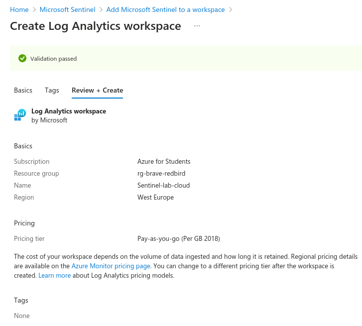
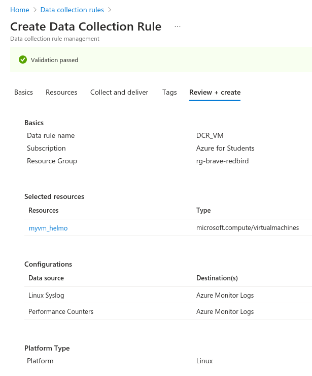
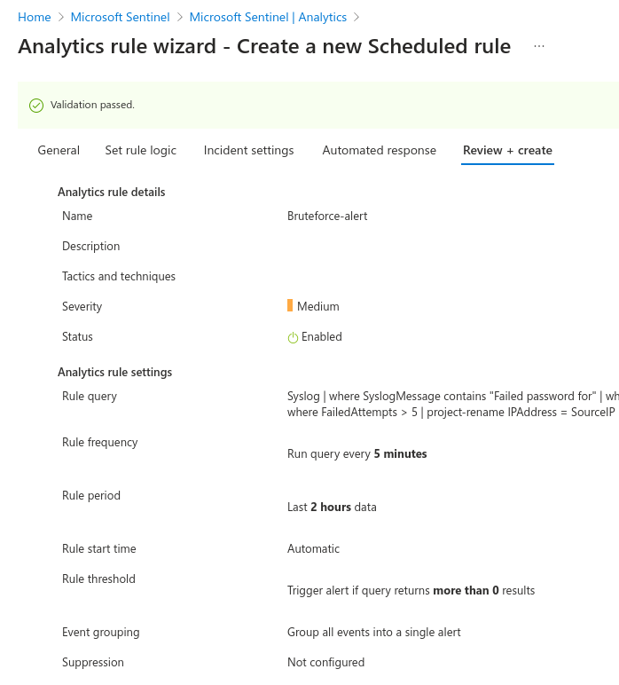
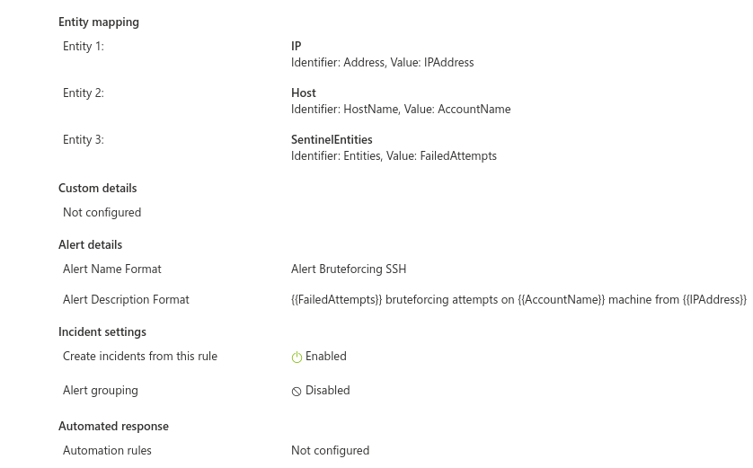
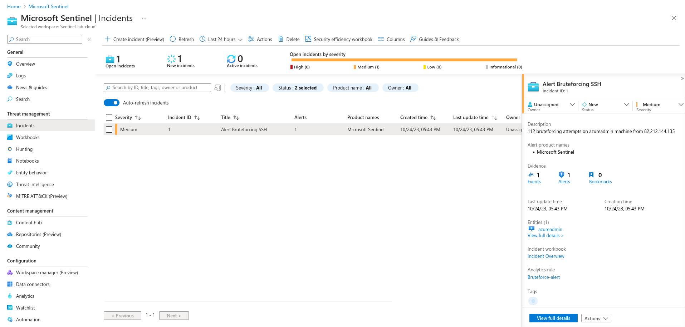
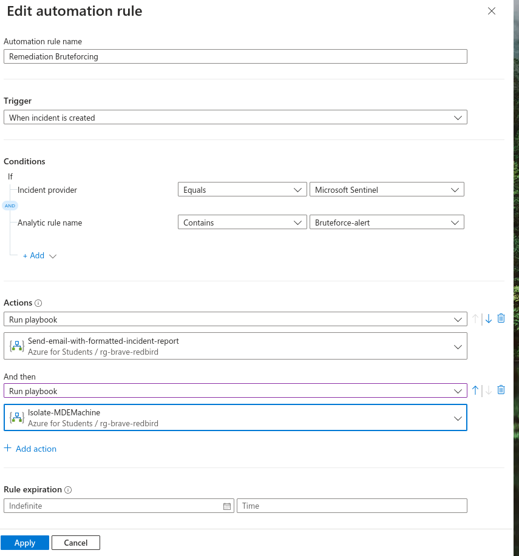

# Mise en place de Azure Sentinel sur notre infrastructure

## 1. Création du Workspace
Lors de la création de MS Sentinel, il faut créer un workspace lié au ressource group contenant les machines dont les logs doivent être remontés.



## 2. Création du Data Collection Rule (DCR)
Le DCR définit le processus de collection des données pour une ressource. Cette étape permet d'installer Syslog sur la machine virtuel myVM_HELMO et de remonter les logs vers le SIEM Sentinel.
**Notes :** 
- La data source "Performance Counters" a été installée afin de mesurer les performances de la machine
- Les valeurs "Linux Syslog" et "Performances Counters" sont laissées par défaut.
- La destination des logs est dirigée vers le SIEM sentinel
 


## 3. Création du threat alert
Cette alerte permettra de détecter les tentatives de bruteforce SSH sur la machine virtuel

- Créer une nouvelle règle : `Sentinel > Analytics > Scheduled Query Rule`
- Pour plus de clarter, la règle de corrélation mise en place est la suivante :
```KQL
Syslog
| where SyslogMessage contains "Failed password for"
| where SyslogMessage contains "ssh"
| parse SyslogMessage with * "Failed password for" AccountName "from" SourceIP "port" Port
| summarize FailedAttempts = count() by SourceIP, AccountName
| where FailedAttempts > 5
| project-rename IPAddress = SourceIP
```
Les screenshots suivants montrent les données appliquées pour constuire le threat alert:


---
---
# Test du déclenchement d'alerte du SIEM

## 1. Mise en place de l'attaque
Pour réaliser cette attaque, l'utilitaire "hydra" a été utilisé afin de mener une attaque par dictionnaire.
Le dictionnaire utilisé est "rockyou.txt"
```bash
sudo hydra -l azureadmin -P rockyou.txt <IP_AZURE_VM> ssh
```
## 2. Détection dans le SIEM
La capture suivante montre que l'attaque a été détectée par le SIEM


# Automatisation de la remédiation
Pour remédier à cette attaque, une "automation rule" basé sur des playbook a été mise en place :
- Envoi d'un mail afin de prévenir le provider de la VM qu'une attaque est en cours
- Une isolation automatique de la machine attaquée afin de mener une analyse forensic

Ces playbooks proviennent de sources du "content hub" de sentinel :
- Sentinel SOA Essentials - envoi du mail
- Microsoft Defender for Endpoint solution - isolation de la machine

La capture suivante montre les paramètres appliquée à l'automation rule: 


