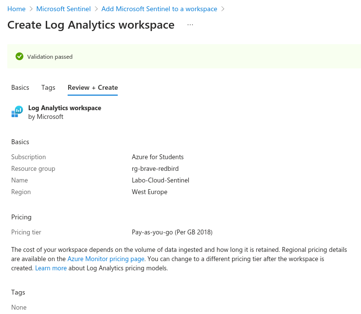
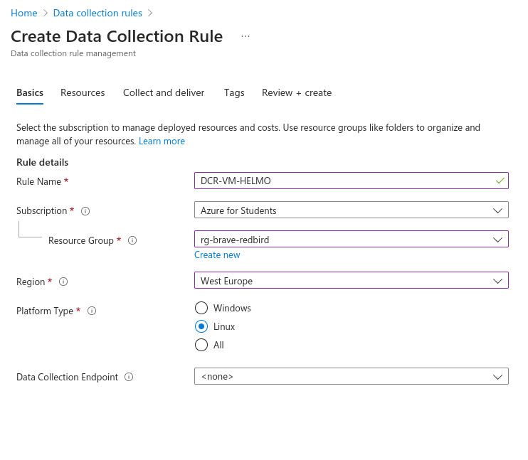
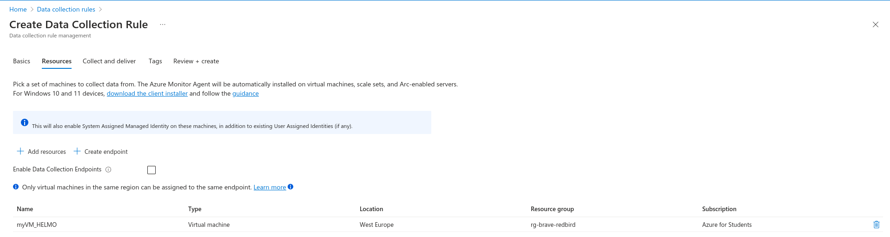
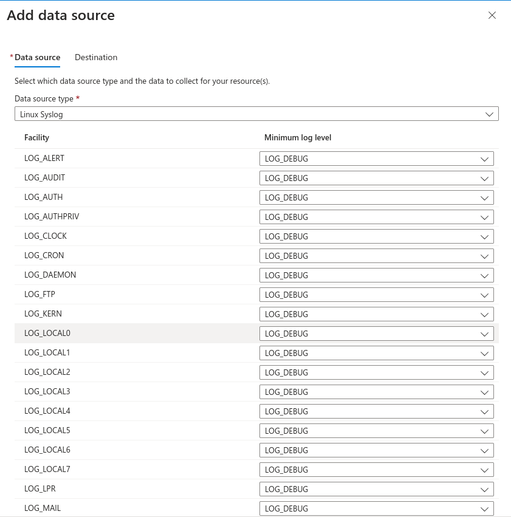
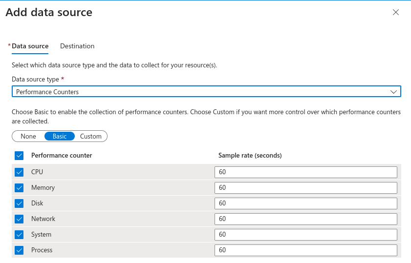
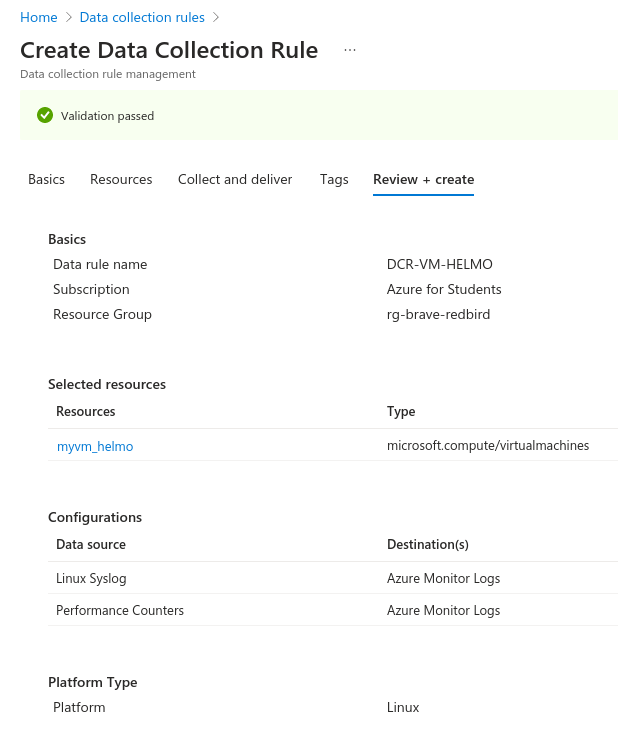
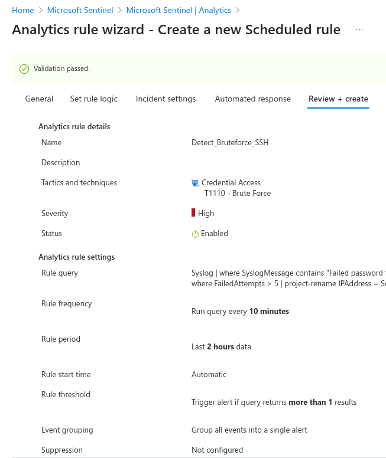
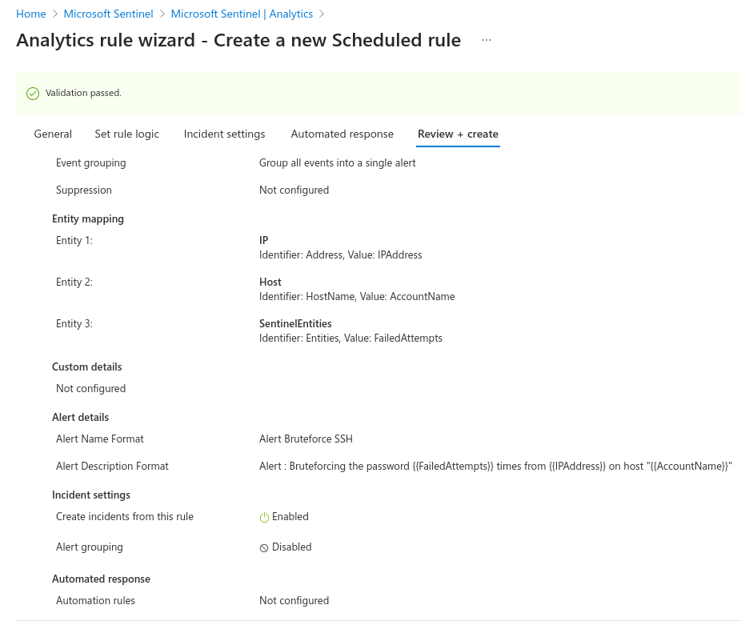

# Mise en place de Azure Sentinel sur notre infrastructure

## 1. Création du SIEM
Les screenshots suivants montrent comment MS Sentinel a été créé dans le ressource group



## 2. Création d'un collection Rule
Cette étape permet de mettre en place la collection de log et l'analyse de performance de la machine virtuelle. Pour ensuite, les envoyer au SIEM.



Définition de la ressource à monitorer.



Installation de Syslog et Performance Counter -> la destination de ces messages de logs vont vers Sentinel





Review des paramètres du DCR (Data Collection Rule)



## 3. Création du threat alert
Une règle a été ajoutée dans Sentinel > Analytics > Scheduled Query Rule

Pour plus de clarter, la règle mise en place est la suivante : 
```KQL
Syslog
| where SyslogMessage contains "Failed password for"
| where SyslogMessage contains "ssh"
| parse SyslogMessage with * "Failed password for" AccountName "from" SourceIP "port" Port
| summarize FailedAttempts = count() by SourceIP, AccountName
| where FailedAttempts > 5
| project-rename IPAddress = SourceIP
```




