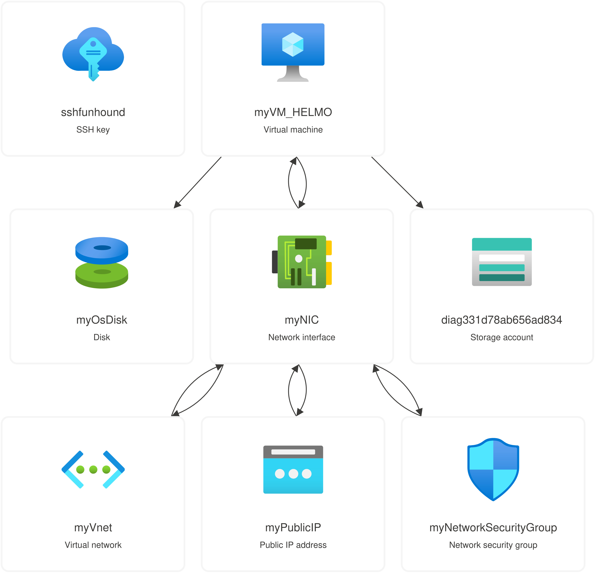
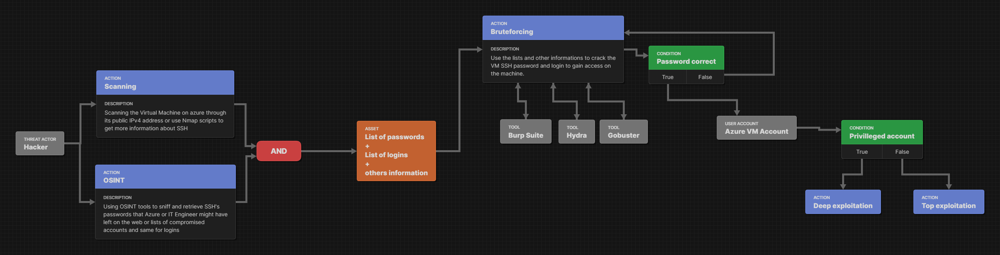

# Labo 2 Cloud : SIEM

Ce labo a pour but de mettre en place un SIEM sur une infrastructure générée avec Terraform. Ce repository contient un README.md avec la description de l'infrastructure mise en place, les fichiers de configuration pour lancer l'infrastructure, un dossier avec un schema d'attaque crée via [Attack Flow Builder](https://center-for-threat-informed-defense.github.io/attack-flow/ui/).
La finalité du projet est de mener une attaque par bruteforce sur la machine afin qu'elle soit détectée par le SIEM.

## Elements de l'architecture
| Element Azure | Nom| Quantité |
|--|--|--|
| Security Group | myNetworkSecurityGroup | 1|
| Network Interface Card | myNIC | 1 |
| Disk | myOSDisk| 1|
| Virtual Machine | myVM_HELMO|1|
| Virtual Network | myVnet|1|
| Public IP Address | myPublicIP|1|

## Description
La machine virtuel est composée des éléments de base : disque, carte réseau (avec IP publique). Elle est placée dans un LAN Virtuel, lui-même placé dans un sécurity group qui joue le role de Firewall pour notre infrastructure. Une paire de clé SSH a été configurée sur la machine afin de pouvoir y accéder à distance.

## Aperçu de l'architecture
 

--- 

# Exemple d'attaque : Bruteforce SSH d'une VM Azure
Le but de cette attaque est de trouver des mots de passe potentiellement vulnérables et de mener un bruteforce sur la machine dans Azure.
| Element| Description |
|--|--|
| Threat Actor | hacker [Correspond à notre attaquant]|
| Action | Scanning [L'attaquant va pour débuter son attaque effectuer un scanning de l'infrastructure cible pour cela il peut récupérer des informations publiques sur celle-ci ou utiliser des outils comme Nmap pour obtenir des informations. Dans notre cas l'attaquant aura trouvé que SSH est ouvert sur l'infra et sera donc sa cible. Après analyse et un essai de connexion SSH il obtient l'information que le moyen d'authentification est le login/password.]|
|Action | OSINT [Dans cette action l'attaquant va essayer de trouver des informations sur des logins présents et des passwords potentiellement utilisés. Pour cela il va récupérer des listes sur le dark web d'utilisateurs compromis ou des listes de mot de passe et utilisateur les plus utilisés. On peut imaginer que il pourrait trouver précisément des leaks concernant la société qu'il souhait attaquer.]|
|Asset | List of passwords + List of logins + Others information [Donc à cet étape l'attaquant est muni d'une ou des liste(s) de logins et de passwords. Mais pas que il peut aussi avoir trouvé des informations sur les utilisateurs du réseau (infos personnelles) qui pourrait être utile pour essayer de trouver des identifiants. Mais aussi à cette étape on peut suppose que l'attaquant a une connaissance extérieure développée de l'infrastructure front-end.]|
|Action | Bruteforcing [Ici il va utiliser ses listes de logins et passwords pour essayer d'obtenir un accès à un compte sur le réseau. Il va essayer de combiner les deux listes en commençant par les combinaisons avec un niveau de certitude élevé et ensuite descendre petit à petit vers des combinaisons plus aléatoire. Dans cette étape l'attaquant peut décider de ne faire que peut de requête par heure ou y aller au maximum possible au risque de vite se faire repérer et donc bloquer.]|
|Tool | Burp Suite,  Hydra ,Gobuster [Ces outils sont des exemples d'outils permettant d'effectuer des attaques par bruteforce dictionnaire ou non.]|
|Condition | Password correct [Si l'attaquant trouve un identifiant il va aller accéder à un [User Account : Azure VM Account]]|
|Condition | Privilleged account [Dans cette condition une fois sur le compte dérobé l'attaquant va vérifier ses privilèges. Si ceux-ci sont élevés il pourra alors aller vers une Deep exploitation c'est à dire réellement exploiter sa victime pour obtenir de l'argent, des informations sensibles ou autre. Tant dit que si il a un utilisateur non élevé il aura le choix de ne pas aller plus loin et conserver les identifiants en espérant ne pas avoir été repéré et revenir dans le futur en espérant que l'utilisateur aurait eu une élévation de privilège ou alors effectuer du scanning réseau interne à l'infra et autre exploitation haut niveau ou même essayer d'infecter un autre utilisateur lui avec des privilèges élevés.]|

